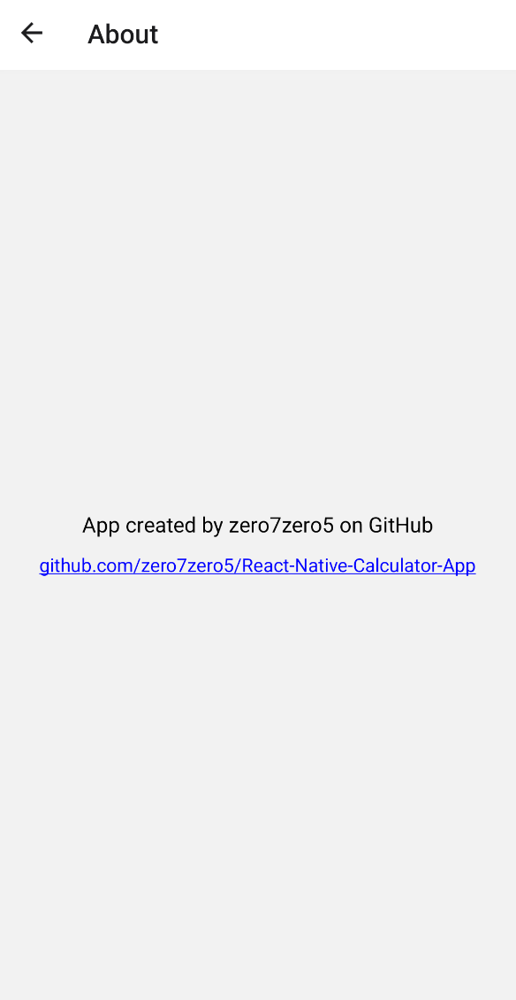

# Testarea Sistemelor Software

### Echipa: A18

- Sandu Eduard Alexandru
- Nitoi Antonio
- Alexe Vasile Paul

### Tema proiectului: **Testarea unei aplicatii mobile**

#### Prezentarea proiectului se poate gasi [aici](Presentation.pdf).
#### Video Demo se poate gasi [aici (YouTube)](https://youtu.be/F4ZRi4UtS34).

# Jest Coverage Report

<!-- Jest Coverage Comment:Begin -->
| Lines | Statements | Branches | Functions |
| --- | --- | --- | --- |
| <a href="https://github.com/AlexePaul/TestareaSistemelorSoftware/blob/d6aa1511830b6728098e401dd203138fcdaed55a/README.md"></a><br/> | 100% (63/63) | 100% (23/23) | 100% (27/27) |

<details><summary>Coverage Report (<b>100%</b>)</summary><table><tr><th>File</th><th>% Stmts</th><th>% Branch</th><th>% Funcs</th><th>% Lines</th><th>Uncovered Line #s</th></tr><tbody><tr><td><b>All files</b></td><td><b>100</b></td><td><b>100</b></td><td><b>100</b></td><td><b>100</b></td><td>&nbsp;</td></tr><tr><td>&nbsp; &nbsp;<a href="https://github.com/AlexePaul/TestareaSistemelorSoftware/blob/d6aa1511830b6728098e401dd203138fcdaed55a/About.js">About.js</a></td><td>100</td><td>100</td><td>100</td><td>100</td><td>&nbsp;</td></tr><tr><td>&nbsp; &nbsp;<a href="https://github.com/AlexePaul/TestareaSistemelorSoftware/blob/d6aa1511830b6728098e401dd203138fcdaed55a/AboutButton.js">AboutButton.js</a></td><td>100</td><td>100</td><td>100</td><td>100</td><td>&nbsp;</td></tr><tr><td>&nbsp; &nbsp;<a href="https://github.com/AlexePaul/TestareaSistemelorSoftware/blob/d6aa1511830b6728098e401dd203138fcdaed55a/Button.js">Button.js</a></td><td>100</td><td>100</td><td>100</td><td>100</td><td>&nbsp;</td></tr><tr><td>&nbsp; &nbsp;<a href="https://github.com/AlexePaul/TestareaSistemelorSoftware/blob/d6aa1511830b6728098e401dd203138fcdaed55a/Home.js">Home.js</a></td><td>100</td><td>100</td><td>100</td><td>100</td><td>&nbsp;</td></tr><tr><td>&nbsp; &nbsp;<a href="https://github.com/AlexePaul/TestareaSistemelorSoftware/blob/d6aa1511830b6728098e401dd203138fcdaed55a/TextBox.js">TextBox.js</a></td><td>100</td><td>100</td><td>100</td><td>100</td><td>&nbsp;</td></tr></tbody></table></details>
<!-- Jest Coverage Comment:End -->

<br />

# 1. Comparatia a 2 frameworkuri de testare - Jest vs Mocha

Am ales sa comparam framework-urile Jest [3] si Mocha [4] deoarece am observat ca acesta este un subiect dezbatut si fac parte din cele mai comune framework-uri de javascript.

| Jest                                                                          | Mocha                                                                                             |
| ----------------------------------------------------------------------------- | ------------------------------------------------------------------------------------------------- |
| Usor de instalat, configurare minimala, folosind npm                          | Necesita configurare mai complexa necesita instalarea unor librarii aditionale                    |
| Usor de facut mocking                                                         | Nu are mocking integrat, trebuie folosite plugin-uri                                              |
| Este foarte popular, astfel avand multe resurse la dispozitie pentru a invata | Este specializat in javascript testing, nu neaparat ideal pentru mobile development               |
| Este mai potrivit d.p.d.v. al vitezei de rulare a testelor                    | Are spectru larg de librarii, este flexibil si este mai potrivit pentru proiecte mari si complexe |

## Exemplificarea comparatiei Jest vs Mocha folosind secvente de cod

Pentru a exemplifica argumentele aduse si pentru a putea deduce care dintre framework-uri este cel mai potrivit pentru tipul nostru de teste vom analiza prin cateva code snippets cum vom face mai multe tipuri de teste atat cu Jest, cat si cu Mocha.

### Teste unitare - Unit tests

In ceea ce priveste testele unitare, cele 2 framework-uri au un mod de functionare asemanator, insa tindem sa apreciem Jest fiind ceva mai intuitiv - in acest caz testam aceeasi functie pe un test unitar:

#### Jest

```JS
// sum.js
function sum(a, b) {
  return a + b;
}
module.exports = sum;

// sum.test.js
const sum = require('./sum');

test('adds 1 + 2 to equal 3', () => {
  expect(sum(1, 2)).toBe(3);
});

```

#### Mocha

```JS
// sum.js
function sum(a, b) {
  return a + b;
}
module.exports = sum;

// sum.test.js
const assert = require('assert');
const sum = require('./sum');

describe('Sum', () => {
  it('should return 3 when adding 1 and 2', () => {
    assert.strictEqual(sum(1, 2), 3);
  });
});

```

### Teste de integrare - Integration testing

Testele de integrare constituie in a urmari interactiunea dintre mai multe module, componente si diverse secvente din cod. Astfel, pentru a ne asigura ca fiecare componenta functioneaza corespunzator, avem nevoie sa testam acest lucru fara a influenta alte componente sau dependencies - de cele mai multe ori prin a simula o anumita interactiune (mocking).

#### Jest

```JS
// fetchData.test.js
import React from 'react';
import { render, act } from '@testing-library/react';
import FetchData from './FetchData'; // Replace with path to your component

jest.mock('api/data.json', () => ({
  title: 'Test Title',
  content: 'Test Content',
}));

test('fetches data and displays it', async () => {
  const { getByText } = render(<FetchData />);

  await act(async () => {
    // Wait for data to be fetched
  });

  expect(getByText('Test Title')).toBeInTheDocument();
});

```

Am discutat anterior ca este mai usor sa facem mocking in Jest datorita existentei sale integrate, insa este util doar daca folosim date de mocking scrise de noi (spre exemplu, un fisier cu posibile date ce le-ar returna un API in format JSON)

Acest lucru face jest sa fie foarte time-consuming pentru ca ar insemna sa fie nevoie sa scriem date de test pentru toate interactiunile noastre cu alte componente sau dependencies.

#### Mocha

```JS
// fetchData.test.js
import { expect } from 'chai';
import sinon from 'sinon';
import React from 'react';
import { shallow } from 'enzyme';
import FetchData from './FetchData'; // Replace with path to your component

describe('FetchData component', () => {
  let fetchStub;

  beforeEach(() => {
    fetchStub = sinon.stub(global, 'fetch');
    fetchStub.resolves({ ok: true, json: () => ({ title: 'Test Title', content: 'Test Content' }) });
  });

  afterEach(() => {
    fetchStub.restore();
  });

  it('fetches data and displays it', async () => {
    const wrapper = shallow(<FetchData />);

    await new Promise((resolve) => setTimeout(resolve, 0)); // Simulate async operation

    expect(wrapper.find('h1').text()).to.equal('Test Title');
  });
});

```

In schimb, in Mocha avem avantajul existentei unor librarii care ne fac viata mai usoara - avem control total asupra datelor mockuite si putem astfel sa le personalizam pentru a efectua testele de care avem nevoie folosind stubbing [5] (Sinon in acest caz este o librarie care ofera atat mocking cat si stubbing). [8]

### Teste functionale - Functionality testing

In ceea ce priveste testarea functionala, vom arata diferentele dintre cele 2 framework-uri in testarea unui buton care la click va afisa un label si va apela un `alert()`.

Jest poate fi deseori mai usor de folosit intrucat poate simula randarea unor componente fara a fi nevoie de mocking/stubbing al elementelor precum butoane, alerte etc. In Mocha, pentru a verifica daca un buton interactioneaza bine cand este apasat, trebuie sa mockuim obiectul `window` pentru a controla functii precum `alert()`, lucru care nu este tocmai optim din punct de vedere al performantei si al timpului de redactare al testelor.

#### Jest

```JS
// MyButton.test.js
import React from 'react';
import { render, fireEvent } from '@testing-library/react';
import MyButton from './MyButton';

test('renders label and triggers alert on click', () => {
  const { getByText, getByRole } = render(<MyButton label="Click Me" />);

  expect(getByText('Click Me')).toBeInTheDocument();

  fireEvent.click(getByRole('button'));

  expect(window.alert).toHaveBeenCalledWith('Button Clicked!');
});
```

#### Mocha

```JS
// MyButton.test.js
import React from 'react';
import { expect } from 'chai';
import sinon from 'sinon';
import { shallow } from 'enzyme';
import MyButton from './MyButton';

describe('MyButton component', () => {
  let alertStub;

  beforeEach(() => {
    alertStub = sinon.stub(window, 'alert');
  });

  afterEach(() => {
    alertStub.restore();
  });

  it('renders label and triggers alert on click', () => {
    const wrapper = shallow(<MyButton label="Click Me" />);

    expect(wrapper.find('button').text()).to.equal('Click Me');

    wrapper.find('button').simulate('click');

    expect(alertStub.calledOnceWith('Button Clicked!')).to.be.true;
  });
});
```

Code snippets generate de ChatGPT [6] & Gemini [7].

# 2. Testarea unei aplicatii mobile folosind un framework - Jest

In procesul de testare a unei aplicatii mobile am ales o aplicatie deja implementata in React Native - o aplicatie calculator asupra careia am efectuat multiple tipuri de teste pentru a ne apropia de 100% coverage.

Mai multe detalii despre aplicatia preluata si drepturile de autor vom gasi [aici](https://github.com/AlexePaul/TestareaSistemelorSoftware/blob/main/CalculatorApp/README.md).

Aplicatia dispune de 2 ecrane: ecranul principal (Home) si pagina de About us. Acestea folosesc cateva componente extra (Textbox, Button) pe care le-am inglobat in componente separate pentru a le putea testa.




### Teste unitare - Unit Testing

Testele unitare au avut in vedere un coverage total pentru componenta Home - componenta cu care utilizatorul va interactiona in marea majoritate de timp. Trebuie sa ne asiguram ca prin eventuale update-uri fiecare dintre butoanele calculatorului functioneaza corect si nu exista bug-uri vizuale sau functionale

Spre exemplu, pentru a testa functionalitatea butonului AC care sterge tot din casuta de input:

```JS
  test("AC Button works correctly", async () => {
    const { getByTestId, getByText } = render(<Home />);
    const textInput = getByTestId("text-input");

    // update text input to have a number to check if it clears when pressing AC Button

    await fireEvent.changeText(textInput, "4873789598275");

    // get AC Button element and fire clicking event

    const button = getByText("AC");
    await fireEvent.press(button); // uncomment this line to see proper efect of test working

    // Now we have to check if the content of the text input is empty

    expect(textInput.props.value).toEqual('');

  });
```

Sau pentru a testa functionalitatea butoanelor numerice:

```JS
  test("Number Buttons work correctly", async () => {
    const { getByTestId, getByText } = render(<Home />);
    const textInput = getByTestId("text-input");
    await fireEvent.changeText(textInput, "");

    const one = getByText("1");
    await fireEvent.press(one);
    expect(textInput.props.value).toEqual('1');

    const two = getByText("2");
    await fireEvent.press(two);
    expect(textInput.props.value).toEqual('12');

    const three = getByText("3");
    await fireEvent.press(three);
    expect(textInput.props.value).toEqual('123');

    // ...

    const seven = getByText("7");
    await fireEvent.press(seven);
    expect(textInput.props.value).toEqual('7');

    const eight = getByText("8");
    await fireEvent.press(eight);
    expect(textInput.props.value).toEqual('78');

    const nine = getByText("9");
    await fireEvent.press(nine);
    expect(textInput.props.value).toEqual('789');

    const zero = getByText("0");
    await fireEvent.press(zero);
    expect(textInput.props.value).toEqual('7890');

    const point = getByText(".");
    await fireEvent.press(point);
    expect(textInput.props.value).toEqual('7890.');

  });
```

### Teste de UI/Functionalitate - UI Testing

Testele de UI au rolul de a asigura incarcarea corecta a componentelor aplicatiei si de plasarea fireasca in cadrul paginilor. Aceste teste compara diverse componente cu un snapshot al aplicatiei - practic, componentele sunt mockuite si convertite in JSON pentru a le compara cu codul HTML al snapshotului.

```JS
  test("Text box component matches snapshot", () => {
    const tree = renderer.create(<TextBox> 1234 </TextBox>).toJSON();
    expect(tree).toMatchSnapshot();
  });

  test("Button component matches snapshot", () => {
    const tree = renderer.create(<Button />).toJSON();
    expect(tree).toMatchSnapshot();
  });

  test("Home screen matches snapshot", () => {
    const tree = renderer.create(<Home />).toJSON();
    expect(tree).toMatchSnapshot();
  });
```

### Rularea testelor folosind Jest

In fisierul `package.json` am initializat libraria Jest astfel incat sa caute in folderul `components` testele pentru a le putea rula.

```JS
  "scripts": {
    "start": "expo start",
    "android": "expo start --android",
    "ios": "expo start --ios",
    "web": "expo start --web",
    "test": "jest"
  },
  "jest": {
    "preset": "react-native",
    "transform": {
      "^.+\\.jsx?$": "<rootDir>/node_modules/babel-jest"
    },
    "testMatch": [
      "<rootDir>/components/testing/*.test.js"
    ],
    "coverageThreshold": {
      "global": {
        "branches": 10,
        "functions": 10,
        "lines": 10,
        "statements": -30
      }
    }
  },
```

Pentru a rula testele, folosim comanda:

```
npm test
```

### Mutation Testing folosind Stryker

Am folosit unealta Stryker [10] pentru a genera mutatii pentru componentele pe care dorim sa le testam in profunzime - aceste mutatii vor modifica la intamplare parti din componente iar mai apoi va rula testele scrie folosind Jest si va realiza un coverage report nou pentru fiecare componenta.


In speta, mutation testing ne ajuta sa ne dam seama daca testele trebuie imbunatatite prin mici schimbari aduse componentelor pe care le vom testa. Schimbarile aduse de Stryker nu vor schimba logica de functionare a paginii.

Un exemplu de mutation testing mai in amanunt ar fi aceasta modificare conditionala:


### Coverage Report folosind Github Actions

Pentru a obtine un coverage report automat si a rula testele odata cu orice commit/PR realizat pe branchul main, am folosit Github Actions pentru a initializa un workflow de testare automat care sa se actualizeze in timp real dupa eventuale update-uri ale aplicatiei.

Acest workflow va instala pachetele necesare si va rula testele pentru a actualiza coverage-ul in fisierul `README.md` si va marca commitul corespunzator daca toate testele au fost efectuate cu succes.

Acest workflow a fost configurat [aici](https://github.com/AlexePaul/TestareaSistemelorSoftware/blob/main/.github/workflows/coverage.yml).


### Raport AI - Folosirea de unelte AI pentru generarea de teste

Am rugat ChatGPT [6] sa scrie cateva teste unitare pentru a testa butoanele AC / C si le vom compara cu cele scrise de noi:

#### AI Generated Unit Test pentru butonul AC

```JS

test('AC button clears input', () => {
    const { getByTestId, getByPlaceholderText } = render(<Home />);
    const acButton = getByTestId('ac-button');
    const inputField = getByPlaceholderText('Enter value');

    fireEvent.press(acButton);

    // aici, este mockuit butonul dar nu si inputul pentru a verifica daca textul sau este sters

    expect(inputField.props.value).toBe('');
});
```

Am rugat si Gemini [7] sa faca acelasi lucru:

```JS
test('AC button click clears the input', () => {
  const { getByTestId, rerender } = render(<Home input="123" />);
  const acButton = getByTestId('ac-button');
  fireEvent.press(acButton);
  rerender(<Home />); // Re-render the component to reflect state change
  const inputField = getByTestId('text-box'); // Assuming TextBox has testID
  expect(inputField.props.value).toBe('');
});

```

#### Testele noastre pentru butonul AC

```JS
  test("AC Button works correctly", async () => {
    const { getByTestId, getByText } = render(<Home />);
    const textInput = getByTestId("text-input");

    await fireEvent.changeText(textInput, "4873789598275");

    const button = getByText("AC");
    await fireEvent.press(button);

    expect(textInput.props.value).toEqual('');

  });
```

&#x2611; Dupa cum se poate observa in testul generat de ChatGPT, AI-ul a creat un test coerent ca sintaxa, insa functional vorbind butonul AC este triggeruit desi nu se afla nimic in caseta de input - acest lucru va face ca acest test sa treaca intotdeauna. In testul nostru, vom schimba textul casutei de input cu un numar pentru a verifica mai apoi daca se sterge continutul sau. Practic, in testul generat, stergand "nimic" obtinem tot "nimic", iar acest test devine inutil.

&#x2612; Totusi, cel generat de Gemini arunca o eroare - sintaxa este incorecta - noi nu avem un test id pentru elementul `Button`, si chiar daca am fi avut, gemini il acceseaza incorect prin comanda `getByTestId('ac-button');`. In plus, acesta s-a complicat prin randarea de 2 ori a componentei home cand putea sa mockuiasca strict text boxul.

&#x2611; Insa, la capitolul UI Tests stau ceva mai bine, fiind destul de simple intrucat nu trebuie decat sa executam o comparatie intre 2 JSON-uri iar sintaxa Jest e destul de usoara - testele sunt identice iar ChatGPT si Gemini respecta documentatia celor de la Jest dupa care ne-am inspirat in crearea testelor [9]

#### AI Generated UI Test pentru componentele Home & Button

```JS
test('Button component matches snapshot', () => {
  const tree = renderer.create(<Button />).toJSON();
  expect(tree).toMatchSnapshot();
});

test('Home component matches snapshot', () => {
  const tree = renderer.create(<Home />).toJSON();
  expect(tree).toMatchSnapshot();
});
```

#### Testele noastre de UI

```JS
 test("Button component matches snapshot", () => {
    const tree = renderer.create(<Button />).toJSON();
    expect(tree).toMatchSnapshot();
  });

  test("Home screen matches snapshot", () => {
    const tree = renderer.create(<Home />).toJSON();
    expect(tree).toMatchSnapshot();
  });
```

### Bibliografie

|     | Nume autor | Prenume autor | Titlu articol online                                    | URL                                                                 | Data ultimei accesări |
| --- | ---------- | ------------- | ------------------------------------------------------- | ------------------------------------------------------------------- | --------------------- |
| 1   | Felice     | Sandra        | Jest vs Mocha: Comparing NodeJS Unit Testing Frameworks | https://www.browserstack.com/guide/jest-vs-mocha                    | accesat la 09.04.2024 |
| 2   | Tozzi      | Chris         | Comprehensive Comparison for Unit Testing Tools         | https://saucelabs.com/resources/blog/jest-vs-mocha                  | accesat la 09.04.2024 |
| 3   | -          | -             | Jest Official Documentation                             | https://jestjs.io/docs/tutorial-react-native                        | accesat la 09.04.2024 |
| 4   | -          | -             | Mocha Official Documentation                            | https://github.com/mochajs/mocha                                    | accesat la 09.04.2024 |
| 5   | Syer       | Dave          | Unit Testing with Stubs and Mocks                       | https://spring.io/blog/2007/01/15/unit-testing-with-stubs-and-mocks | accesat la 15.04.2024 |
| 6   | -          | -             | OpenAI Generated Text                                   | https://chat.openai.com                                             | accesat la 16.04.2024 |
| 7   | -          | -             | Gemini Generated Text                                   | https://gemini.google.com                                           | accesat la 16.04.2024 |
| 8   | -          | -             | Sinon Testing Library Documentation                     | https://sinonjs.org/releases/v17/                                   | accesat la 23.04.2024 |
| 9   | -          | -             | Jest Snapshot Testing                                   | https://jestjs.io/docs/snapshot-testing                             | accesat la 8.05.2024  |
| 10  | - | - | Stryker Jest Runner Documentation | https://stryker-mutator.io/docs/stryker-js/jest-runner/ | accesat la 9.05.2024 |
